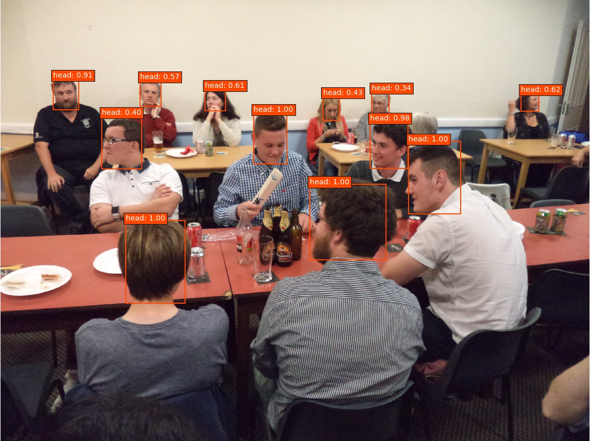

SSD-based head detector
======

<div align="center">
    
</div>

By Pablo Medina-Suarez and Manuel J. Marin-Jimenez.


This repository contains and showcases a head detector model for people detection in images. This model is based on 
the [Single Shot Multibox Detector (SSD)](https://arxiv.org/abs/1512.02325), as described in:
```
SSD: Single Shot MultiBox Detector
Authors: Liu, Wei; Anguelov, Dragomir; Erhan, Dumitru; Szegedy, Christian; Reed, Scott; Fu, Cheng-Yang; Berg, Alexander C. 
```

The model has been trained using the [Hollywood Heads dataset](https://www.robots.ox.ac.uk/~vgg/software/headmview/) as
positive samples, and a subsample of the [EgoHands dataset](http://vision.soic.indiana.edu/projects/egohands/) as negative
samples. This model has been developed using [Pierluigi Ferarri's Keras implementation of SSD](https://github.com/pierluigiferrari/ssd_keras/)
as primary source (of which we provide some essential code), and replicates the original [Matconvnet version of our model](https://github.com/AVAuco/ssd_people).


Quick start
------
### Cloning the repository
First, download a local copy of this repository, to do so, use the "Clone or download" button or run the following commands 
in a terminal:
```bash
# Install git:     
    sudo apt-get install git
# Clone ssd_head_keras from GitHub using the method of your choice: 
    git clone https://github.com/AVAuco/ssd_head_keras.git (HTTPS)
    git clone git@github.com:AVAuco/ssd_head_keras.git (SSH)
```

### Downloading the model
In the case you just want to download our detection model, we provide a ready to use version that you can download via 
the following links. Skip to the next section otherwise.

Since there are differences in the object serialization methods used between Python versions previous
to version 3.6, we provide two different versions of our model (we do not support Python 2.7):

- [Python versions below 3.6](https://drive.google.com/open?id=12cqKTPtQBAu780219hEbST7VwQuf6xDH).
- [Python versions above or equal to 3.6](https://drive.google.com/open?id=1vlmKOBtaT7eAd4_WcAv5MLBn7q_SWXoh).

In the `data` folder you can find a script that will download the model for you, just run the following commands:
```bash
# Install curl, if not already present
    sudo apt-get install curl
# Check your version of Python 3
    python3 --version
# Replace .Y for ".5" or ".6", depending on the output of the previous command 
    cd data
    chmod +x download_model_py3.Y.sh
# Run the script
    ./download_model_py3.Y.sh
```


### How to use the model
A brief tutorial is provided in the Jupyter notebook [demo_inference.ipynb](./demo_inference.ipynb). This tutorial 
explains how to use our model to detect heads over some example images.

To run this notebook on your computer, first take a look at the [software requirements section](#software_reqs), then
run the following commands in a terminal:
```bash
# Activate the Python virtual environment
    source <venv_path>/bin/activate
# Set current directory to this repository's root path
    cd <download_path>/ssd_head_keras
# Start a notebook
    jupyter notebook
```
This command will launch a new tab on your default browser showing the Jupyter notebook environment, just click 
`demo_inference.ipynb` and follow the instructions in it.

Software requirements
------
<a id='software_reqs'></a>
These are the most relevant dependencies required to use our model:
- Python packages: pip3, [virtualenv](https://virtualenv.pypa.io/en/latest/installation/) (recommended), 
[numpy](https://www.scipy.org/install.html#pip-install), [jupyterlab](https://jupyterlab.readthedocs.io/en/stable/getting_started/installation.html) (tutorial), matplotlib, h5py.
- [Tensorflow](https://www.tensorflow.org/install/pip) (developed and tested on `tensorflow-gpu` 1.14).
- [Keras](https://keras.io/#installation) (developed and tested on version 2.2.4).
- [SSD Keras implementation](https://github.com/pierluigiferrari/ssd_keras) (essential code already provided in our repository).

Additional, recommended requirements to increase the inference performance on a NVIDIA GPU:
- NVIDIA CUDA Toolkit (tested on versions 9.0 and 10.0).
- **Optional:** a NVIDIA cuDNN version matching the NVIDIA CUDA Toolkit version installed.

An **optional, not recommended** [requirements file](./requirements.txt) is provided in this repository, which will allow you to install a new virtualenv
with all the required dependencies. Please **note** that this file has been used during development and may install additional, 
unnecessary packages in your system. If you opt for this option, run these commands in a terminal:
```bash
# Create a new Python 3 virtual environment
    virtualenv --system-site-packages -p python3 <venv_path>
# Activate the venv
    source <venv_path>/bin/activate
# Install this project dependencies using the provided requirements file
    pip install -r <download_path>/ssd_head_keras/requirements.txt
```

Performance
------
This head detector uses a 512x512 input size, favouring precision over speed (above 90% mAP on our [Hollywood Heads dataset](https://www.robots.ox.ac.uk/~vgg/software/headmview/)
test split). Nonetheless, this model runs at an average of 40 FPS on a NVIDIA Titan Xp GPU, therefore allowing real time
detections.

### Qualitative results
We show some results of this head detector on the [UCO-LAEO dataset](https://github.com/AVAuco/ucolaeodb) in the 
following video. No temporal smoothing or other kind of post-processing has been applied to the output of the detectors.

**EDIT 02/11/2019: we have uploaded an updated results video!**
<div align="center">
    <a href="https://youtu.be/-1Mu3rFJO0g" alt="Head detections demo video" target="_blank">
        
    </a>
</div>


Citation
------
If you find this model useful, please consider citing the following paper:
```
@InProceedings{Marin19a,
    author       = "Marin-Jimenez, M.~J. and Kalogeiton, V. and Medina-Suarez, P. and Zisserman, A.",
    title        = "{LAEO-Net}: revisiting people {Looking At Each Other} in videos",
    booktitle    = "International Conference on Computer Vision and Pattern Recognition (CVPR)",
    year         = "2019",
}
```

Acknowledgements
------
We thank the authors of the images used in the demo code, which are licensed under a [CC BY 2.0](https://creativecommons.org/licenses/by/2.0/) license:
- [people_drinking.jpg](./examples/people_drinking.jpg), by [Ross Broadstock](https://www.flickr.com/people/figurepainting/).
- [rugby_players.jpg](./examples/rugby_players.jpg), by [jam_90s](https://www.flickr.com/people/zerospin/).
- [fish_bike.jpg](./examples/fish_bike.jpg), [source](https://github.com/BVLC/caffe/blob/master/examples/images/fish-bike.jpg).
